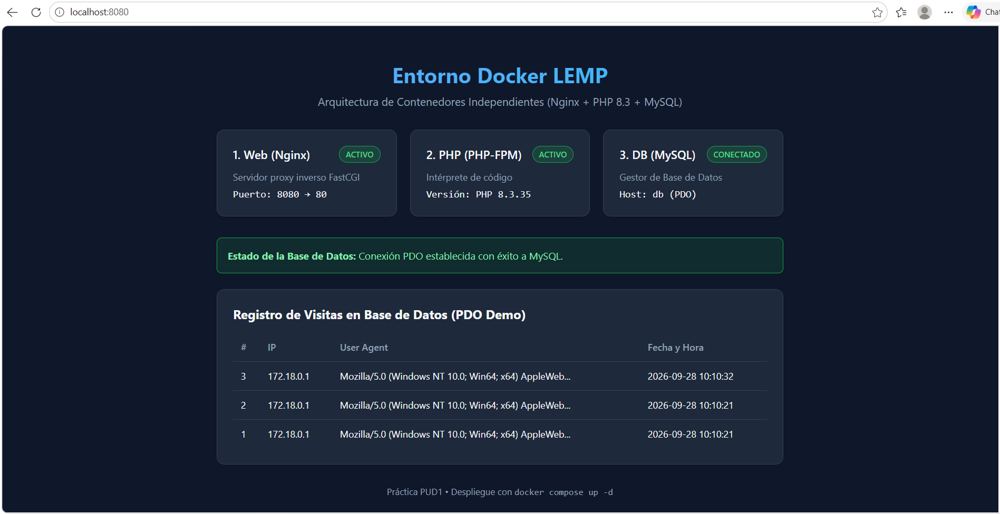

# Práctica UD1 - Servidor con Docker (Nginx, PHP y MySQL)

En esta práctica he montado un entorno de desarrollo web usando contenedores de Docker en lugar de instalar el paquete típico de XAMPP en el ordenador. De esta forma, cada servicio funciona por separado en su propio contenedor independiente.

## ¿Qué contenedores he creado?

He configurado tres contenedores dentro del archivo `docker-compose.yml`:

- **web**: Usamos Nginx para recibir las peticiones en el puerto 8080 y pasárselas a PHP.
- **php**: Ejecuta el código con PHP 8.3. He creado un `Dockerfile` propio para instalarle la extensión `pdo_mysql`, que hace falta para conectarse a la base de datos.
- **db**: Base de datos MySQL donde guardamos los datos.

## Archivos del proyecto

- `docker-compose.yml`: Archivo donde definimos y conectamos los tres contenedores.
- `nginx/default.conf`: La configuración de Nginx para que se comunique con PHP.
- `php/Dockerfile`: Lo usamos para crear la imagen de PHP 8.3 con PDO.
- `src/index.php`: Un archivo PHP sencillo que he hecho para comprobar que la versión es PHP 8.3 y que la conexión con MySQL funciona bien.
- `Captura.png`: Captura de pantalla donde se ve todo funcionando.

## Cómo ponerlo en marcha

1. Para descargar las imágenes y arrancar todos los contenedores a la vez, ejecutamos:

```bash
docker compose up -d
```

2. Una vez que termine de arrancar, abrimos el navegador y entramos en:

http://localhost:8080

3. Si queremos apagar los contenedores cuando terminemos, usamos:

```bash
docker compose down
```

## Captura del resultado

Aquí dejo la captura de pantalla de la página web funcionando en el puerto 8080:


